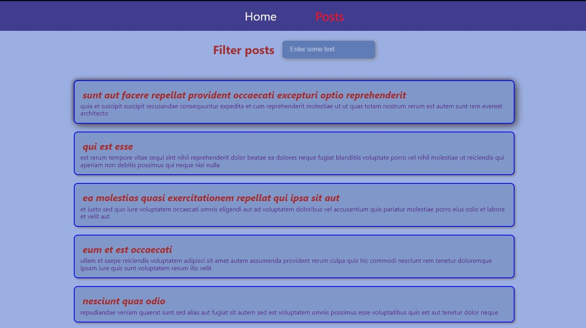
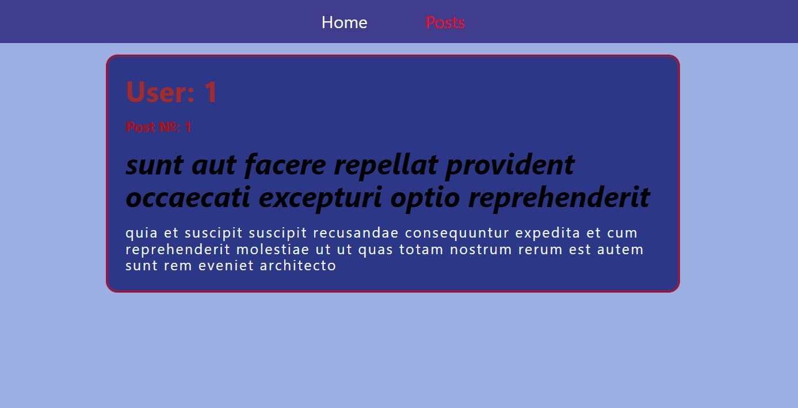

# Posts App

## Screenshots

## Description

Posts App it's a single-page application built on React.js and uses routing to
navigate through pages.

### Tasks

- Set up a new React application using Create React App (CRA).

- Using the Fetch API or axios, fetch data from the JSONPlaceholder API
  (https://jsonplaceholder.typicode.com/posts) which provides dummy data in JSON
  format.

- Fetch the data when the component mounts and store it in the component's
  state. (Done with Redux)

- Render a list of the data. For each item, display at least two pieces of
  information (like the title and body).

Bonus:

- Add routing to your application using react-router-dom and create a detailed
  view. When a user clicks on a post, it should take them to a new page showing
  more details about the clicked post.
- Add error handling to handle the scenario where the API fails to fetch the
  data.
- Add loading state to indicate that data is being fetched.
- Add scroll to top feature
- Add filter feature

### Technologies

- React
- Redux
- React Router
- JavaScript
- HTML
- CSS
